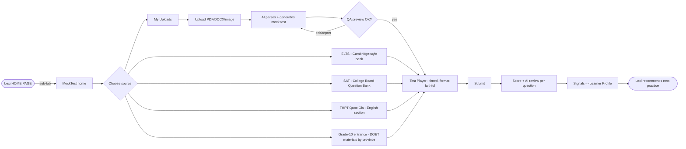

# MockTestTab (Lexi sub-tab) — Design Doc

> Revision v2 — reflects decisions: (1) NO pricing inside this tab (monetization lives at Lexi level), (2) home screen renamed **MockTest**, (3) multi-source question bank: IELTS, SAT (College Board Question Bank), THPT Quốc Gia, Grade-10 entrance (provincial DOET materials), plus **user-uploaded documents auto-generated into mock tests**, (4) flows updated accordingly.

## 1. Summary

MockTestTab is a sub-tab of Lexi (entered from HOME PAGE) where students simulate real exams. Core loop: pick a source (or upload material) → take a timed mock test → get scored + AI review → weaknesses feed the Lexi Learner Profile → Lexi recommends next practice. Differentiator: every mock test result becomes a learning signal for the companion, not a dead-end score — and any document can become a mock test. Riskiest assumption: we can legally source and reliably auto-generate exam-quality questions.

## 2. User Psychology & Segments

| Segment | Context | Motivation | Anxiety | Current alternative |
|---|---|---|---|---|
| Grade-9 → grade-10 entrance (Lexi's core) | Exam in ~June, DOET formats vary by province | "Am I ready? Where do I stand?" | Fear of unknown format, parental pressure | Paper past-tests, cram classes |
| THPT QG students | National exam, English section | Band/score target for university | Score plateau | Free PDF banks, mock-test sites |
| IELTS / SAT aspirants | International track | Target band/score | Cost of real mocks | ieltsmate-style sites, CB practice |

- **JTBD:** "Rehearse the real thing in a safe place, and turn my mistakes into a plan."
- **Behavioral levers:** (a) *anxiety reduction through rehearsal* — timed, format-faithful simulation; (b) *progress visibility* — score trend per source over time (feeds Lexi's dashboard); (c) *companion encouragement* — Lexi Companion frames results as next steps, never as verdicts (aligns with "Behavior > Self-report" principle).
- **Anti-personas:** teachers building classroom tests (later, maybe), adult casual learners with no exam date.

## 3. Core Loop & Mechanics

**Loop:** exam date pressure (trigger) → take mock (action) → score + AI review (reward) → weaknesses written to Learner Profile & next-practice recommendation (investment).

| Mechanic | Drives | Data it needs |
|---|---|---|
| Multi-source bank (IELTS / SAT CB / THPT QG / DOET grade-10) | Choice fits the user's actual exam | Source, ExamTemplate, Question |
| Upload → generate mock test | Long-tail content; "my teacher's PDF becomes a test" | UserUpload, GenerationJob, generated Questions |
| Timed test session (format-faithful) | Rehearsal value, anxiety reduction | TestAttempt, AnswerRecord |
| Scoring + AI review | Reward, comprehension of mistakes | AnswerRecord, rubric per template |
| Signal emission to Learner Profile | Lexi-wide personalization (M2.4/M2.5 engines) | SkillSignal per attempt |

- **Cold start:** seed with public/past official papers per source; user uploads cover provincial variety. No social mechanics in v1, so no social cold-start problem.
- **Failure states:** abandoned test → resumable session (state saved per question); failed/low-quality generation → QA review screen with "report question"; upload parse failure → clear error + tips (file type, scan quality).

## 4. UX/UI Flows

Screen inventory: **MockTest** (home, renamed from "Trang chủ"), **Source Browser** (filter by exam type / province / year / skill), **Upload & Generate**, **Test Player** (timed), **Results & Review**, **History**. Pricing screen: REMOVED — upgrade prompts, if any, deep-link to Lexi-level billing.



Emotional annotations: source choice = *anxious, reduce options via "your exam" default from profile*; test player = *focused, zero chrome, no Lexi companion interruptions*; results = *vulnerable — companion tone, mistakes framed as next steps*; upload wait = *impatient — show generation progress + ETA, allow leaving (notify when ready)*.

## 5. Back-end Architecture

Modular monolith inside the existing Next.js + Prisma app (matches current Lexi architecture; no microservices at this scale).

| Module | Owns | Sync / async |
|---|---|---|
| `content` | Sources, templates, curated question bank, ingestion of official materials | Ingestion async (admin content-import already exists — extend it) |
| `generation` | Upload parsing (OCR/PDF), question generation via existing `AIProvider` (Gemini/Claude/Mock), QA heuristics | Background job (GenerationJob) with status polling |
| `mocktest` | Test sessions, timing, resume, submission | Sync |
| `scoring` | Objective scoring + AI review for open answers | Objective sync; AI review async |
| `signals` | Emit SkillSignal to Learner Profile (M2.4 Learning Signal Engine) | Async, fire-after-commit |

API sketch: `GET /api/mocktest/sources`, `GET /api/mocktest/tests?source=...`, `POST /api/mocktest/uploads`, `GET /api/mocktest/uploads/:id/status`, `POST /api/mocktest/attempts`, `PATCH /api/mocktest/attempts/:id` (answers/heartbeat), `POST /api/mocktest/attempts/:id/submit`.

**Hardest problems + v1 answers:** (1) *Parse fidelity of uploads* — restrict v1 to text PDF/DOCX, image OCR later; always show QA preview before test is usable. (2) *Question quality* — generation prompt per ExamTemplate + automatic checks (answer key consistency, distractor uniqueness) + user "report question". (3) *Licensing* — see §7; build source registry with license field from day 1.

## 6. Database Schema (Prisma-style sketch)

```prisma
model Source        { id String @id; name String; examType ExamType; province String?; license String; }
model ExamTemplate  { id String @id; sourceId String; structureJson Json; timeLimitMin Int; scoringRubric Json; }
model MockTest      { id String @id; templateId String; origin TestOrigin; uploadId String?; status TestStatus; }
model Question      { id String @id; mockTestId String; sectionKey String; type QType; contentJson Json; answerKey Json; skillTags String[]; }
model UserUpload    { id String @id; userId String; fileUrl String; parseStatus JobStatus; }
model GenerationJob { id String @id; uploadId String; providerUsed String; status JobStatus; errorNote String?; }
model TestAttempt   { id String @id; userId String; mockTestId String; startedAt DateTime; submittedAt DateTime?; state Json; score Json?; }
model AnswerRecord  { id String @id; attemptId String; questionId String; answerJson Json; correct Boolean?; aiReview Json?; }
// SkillSignal: reuse Lexi's existing Learning Signal Engine tables (M2.4) — do not duplicate.
```

Why each: `Source`/`ExamTemplate` = multi-source mechanic; `MockTest`/`Question` = both curated and generated tests share one shape; `UserUpload`/`GenerationJob` = upload mechanic + async pipeline; `TestAttempt`/`AnswerRecord` = session, resume, scoring, review. Scale pain: score-trend queries per user per source → composite index `(userId, mockTestId, submittedAt)`; question bank browse → index `(sourceId, examType, province)` on joined views.

## 7. Open Questions & Riskiest Assumptions

1. **Licensing (could kill the feature):** College Board and Cambridge materials are copyrighted. v1 must either link out / use only user-owned uploads for those, or license content. DOET past papers are commonly redistributed but verify per province. The source registry's `license` field is mandatory, and "generate from user upload" is the legally safest pillar — consider leading with it.
2. **Scope of THPT QG:** Lexi is an English coach — English section only for v1 (assumed).
3. **Generation QA bar:** what error rate is acceptable before students lose trust? Needs a small human-review loop early on.
4. **Province coverage** for grade-10 entrance: start with 3–5 provinces with the largest user base (assumed HN/HCM first).
5. Whether MockTest results should gate/unlock anything in Lexi (streak integration) — deliberately out of scope here.
